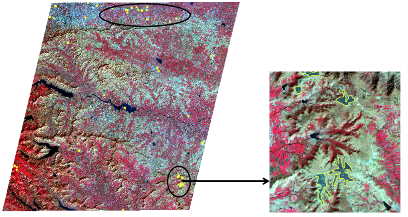
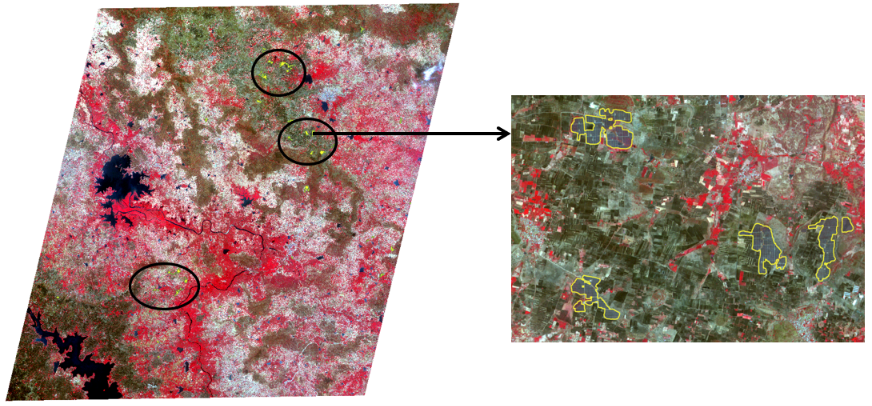

<div align="center">

# 🛰️ Beyond CNNs: Transformer-Based Segmentation of Solar Farms
### Using IRS LISS-IV Satellite Imagery

[](https://www.nrsc.gov.in)
[](https://python.org)
[](https://pytorch.org)
[](LICENSE)
[](https://www.nvidia.com)

> **Internship Project** | National Remote Sensing Centre (NRSC), ISRO Hyderabad  
> **Period:** 10th June 2026 – 25th July 2026  
> **Supervisor:** Mr. Naresh Nagamalle, Sci/Eng.-SF, BCGG, BG&WSA, NRSC, ISRO

</div>

---

## 📋 Table of Contents

- [Overview](#-overview)
- [The Problem](#-the-problem)
- [Key Innovations](#-key-innovations)
- [Architecture](#-architecture)
- [Dataset](#-dataset)
- [Results](#-results)
- [Visual Inference](#-visual-inference)
- [Installation](#-installation)
- [Project Structure](#-project-structure)
- [Tech Stack](#-tech-stack)
- [References](#-references)
- [Acknowledgements](#-acknowledgements)

---

## 🌍 Overview

India has committed to **500 GW of installed renewable energy capacity by 2030**, with solar energy contributing **300 GW**. Tracking this rapid expansion from space requires accurate, automated geospatial monitoring.

This project builds a **deep learning pipeline** for automated solar farm detection using **LISS-IV satellite imagery** from India's own **Resourcesat-2/2A** satellites — operating at a spatial resolution of **5.8 metres**.

Three cutting-edge architectures were implemented and benchmarked:

| Model | Type | Val IoU | Val F1 |
|---|---|---|---|
| **Attention U-Net** (ResNet50 + SE Block) | CNN + Attention | 0.6759 | 0.7978 |
| **SegFormer** (mit-b0) | Hierarchical Transformer | **0.8520** | **0.9201** |
| **DINOv2** (ViT-Small) | Vision Foundation Model | 0.8296 | 0.9069 |

> ✅ **SegFormer achieved the best overall performance** — making this the first known application of transformer-based segmentation on LISS-IV solar farm data.

---

## 🎯 The Problem

Without accurate geospatial data on solar farm locations:
- Governments cannot track renewable energy infrastructure growth
- Land-use conflicts with agricultural and ecological areas go undetected
- Policy decisions lack the spatial evidence needed for sustainable planning

Prior approaches relied on **foreign satellite imagery (Sentinel-2)** and **conventional CNN-based models**. This work fills the gap using **India's own satellite data** and **frontier AI architectures**.

---

## 💡 Key Innovations

```
┌─────────────────────────────────────────────────────────────────┐
│  1. First use of SegFormer + DINOv2 on LISS-IV satellite data  │
│  2. DINOv2 (142M image pre-training) applied to ISRO EO data   │
│  3. Attention gates to suppress false positives from water,     │
│     barren land, and metallic rooftops                          │
│  4. Multi-model comparative study: CNN vs Transformer vs ViT   │
│  5. Full pipeline on indigenous Resourcesat-2/2A imagery        │
└─────────────────────────────────────────────────────────────────┘
```

---

## 🏗️ Architecture

### Model 1 — Attention U-Net (ResNet50 + SE Block)

```
Input (128×128×3) ──► ResNet50 Encoder ──► Bottleneck
                            │                    │
                      Skip Connections      Attention Gates
                            │                    │
                       SE Blocks ◄──────── Decoder ──► Binary Mask
```

- **Backbone:** ResNet50 with residual connections
- **Attention:** Spatial attention gates suppress background noise
- **SE Block:** Channel-wise feature recalibration
- **Best for:** Precise boundary delineation, false positive suppression

---

### Model 2 — SegFormer (mit-b0 Backbone)

```
Input Image
    │
    ▼
┌─────────────────────────────────────┐
│   Hierarchical Transformer Encoder  │
│   Stage 1 → Stage 2 → Stage 3 → 4  │
│   (Multi-head Self-Attention)       │
└─────────────────┬───────────────────┘
                  │ Multi-scale Features
                  ▼
        ┌─────────────────┐
        │  MLP Decoder    │  ← Lightweight, no positional encoding
        └────────┬────────┘
                 ▼
          Binary Mask (Solar / Non-Solar)
```

- **Encoder:** Mix Transformer (MiT-b0) — global self-attention
- **Decoder:** Simple MLP — fast inference
- **Best for:** Large spatially spread solar farm structures

---

### Model 3 — DINOv2 (Vision Foundation Model)

```
Pre-trained on 142 Million Images (Self-Supervised)
        │
        ▼  Fine-tuned on LISS-IV Solar Farm Dataset
┌───────────────────────────┐
│   ViT-Small Backbone      │
│   (Vision Transformer)    │
│   Multi-head Attention    │
└───────────┬───────────────┘
            │
            ▼
    Segmentation Head
            │
            ▼
     Binary Mask Output
```

- **Pre-training:** Self-supervised on 142M diverse images (Meta AI)
- **Fine-tuned:** On labelled LISS-IV solar farm tiles
- **Best for:** Limited data, rapid convergence, strong generalisation

---

## 📦 Dataset

```
Dataset: LISS-IV TOA Corrected Imagery (Resourcesat-2/2A)
─────────────────────────────────────────────────────────
Satellite        : IRS Resourcesat-2/2A
Sensor           : LISS-IV
Spatial Resolution: 5.8 metres
Bands            : Green, Red, Near-Infrared (3 bands)
Image Format     : GeoTIFF (128 × 128 pixels per chip)
Total Image Chips: 2,641
Total Mask Chips : 2,641
Solar Chips      : 2,026  (≥1 solar pixel)
Non-Solar Chips  :   615  (all background)
Train / Val Split: 80% / 20%  (seed = 42)
Data Source      : ISRO Bhoonidhi Portal
Annotation Tool  : QGIS + OpenStreetMap + Manual Verification
```

**Mask Generation Pipeline:**
```
OpenStreetMap Solar Boundaries
        │
        ▼
  Manual Verification in QGIS
        │
        ▼
  Rasterization to LISS-IV resolution
        │
        ▼
  Binary GeoTIFF masks (0 = background, 1 = solar farm)
```

---

## 📊 Results

### Training Performance Comparison

| Metric | Attention U-Net | SegFormer | DINOv2 |
|---|---|---|---|
| **Epochs** | 28 | 68 | 33 |
| **Avg Epoch Time** | 39.4 sec | **11.03 sec** | 25.84 sec |
| **Total Train Time** | ~18 min | ~13 min | ~14.5 min |
| **Best Val IoU** | 0.6759 | **0.8520** | 0.8296 |
| **Best Val F1** | 0.7978 | **0.9201** | 0.9069 |
| **Best Val Loss** | 0.3610 | **0.1757** | 0.4095 |
| **Convergence** | Slow | Fast | **Very Fast** |

### Loss Function Used

All models trained with a combined:

```
Total Loss = Dice Loss + Binary Cross-Entropy (BCE) Loss + Focal Loss
```

- **Dice Loss** → Optimises region-level overlap
- **BCE Loss** → Pixel-wise classification accuracy
- **Focal Loss** → Handles class imbalance at boundaries

### Optimizer Configuration

| Model | Optimizer | Learning Rate |
|---|---|---|
| Attention U-Net | AdamW | 1e-4 |
| SegFormer | Fused AdamW | 6e-5 |
| DINOv2 | AdamW | Dual LR groups, weight decay = 0.05 |

---

## 🖼️ Visual Inference

Inference was run on **5 unseen LISS-IV satellite scenes**. Yellow boundary polygons show predicted solar farm extents overlaid on False Colour Composite (FCC) imagery.

> 🔴 Red = Dense Vegetation | 🔵 Dark Blue = Water Bodies | ⬜ Grey/White = Bare Land / Urban

### Inference Feature Count per Model

| Image Scene | U-Net | SegFormer | DINOv2 |
|---|---|---|---|
| o256502451 (09Feb2025) | 86 | 41 | 52 |
| o256502461 (17Apr2025) | 49 | 64 | 47 |
| 256030181 (03Jan2025) | 54 | 41 | 42 |
| 2560301391 (03Jan2025) | 29 | 26 | 15 |
| o256502421 (17Apr2025) | 86 | 69 | 70 |

> **SegFormer** produced the cleanest boundaries with fewest false positives.  
> **DINOv2** showed conservative but highly accurate core detections.  
> **U-Net** had higher feature counts (more false positives in bare land).


## 🖼️ Visual Inference Results

### DINOv2 — Scene V (256030181 | 03 Jan 2025)


### DINOv2 — Scene I (o256502421 | 17 Apr 2025)


> 🟡 Yellow outlines = predicted solar farm boundaries
> 🔴 Red = vegetation | ⬛ Dark = water | ⬜ Grey = bare land / urban
---

## 🛠️ Installation

### Step 1 — Clone the Repository
```bash
git clone https://github.com/Anandraj239/solar-farm-segmentation-lissiv.git
cd solar-farm-segmentation-lissiv
```

### Step 2 — Create Conda Environment
```bash
conda create -n solar_seg python=3.13 -y
conda activate solar_seg
```

### Step 3 — Install GIS / Core Packages
```bash
conda install -c conda-forge affine rasterio fiona geopandas gdal pyproj \
shapely pyogrio geos proj geotiff libgdal-core mapclassify numpy pandas \
matplotlib-base scikit-learn scipy joblib -y
```

### Step 4 — Install PyTorch with CUDA 12.4
```bash
pip install torch==2.6.0+cu124 torchvision==0.21.0+cu124 torchaudio==2.6.0+cu124 \
--index-url https://download.pytorch.org/whl/cu124
```

### Step 5 — Install Deep Learning Libraries
```bash
pip install transformers==5.14.1 tokenizers==0.22.2 safetensors==0.8.0 \
huggingface-hub==1.24.0 albumentations==2.0.8 opencv-python==5.0.0.93
```

### Step 6 — Install Remaining Dependencies
```bash
pip install segmentation-models-pytorch tqdm matplotlib seaborn pandas \
shapely fiona tqdm pyyaml rich
```

### Step 7 — Verify GPU Setup
```python
import torch
print(torch.cuda.is_available())       # Should print: True
print(torch.cuda.get_device_name(0))   # Should print your GPU name
```

---

## 📁 Project Structure

```
solar-farm-segmentation-lissiv/
│
├── 📂 data/
│   ├── 📂 images/              # LISS-IV TOA corrected image chips (128×128)
│   ├── 📂 masks/               # Binary solar farm masks (128×128)
│   └── 📂 raw_scenes/          # Full LISS-IV scenes (GeoTIFF)
│
├── 📂 notebooks/
│   ├── 01_data_preprocessing.ipynb
│   ├── 02_mask_generation.ipynb
│   ├── 03_attention_unet_training.ipynb
│   ├── 04_segformer_training.ipynb
│   ├── 05_dinov2_training.ipynb
│   └── 06_inference_visualization.ipynb
│
├── 📂 models/
│   ├── attention_unet.py       # ResNet50 + SE Block + Attention Gates
│   ├── segformer.py            # SegFormer mit-b0 fine-tuning
│   └── dinov2.py               # DINOv2 ViT-Small fine-tuning
│
├── 📂 utils/
│   ├── dataset.py              # PyTorch Dataset class for LISS-IV chips
│   ├── losses.py               # Dice + BCE + Focal combined loss
│   ├── metrics.py              # IoU, F1, Precision, Recall, Dice
│   ├── preprocessing.py        # TOA correction, tiling, normalization
│   └── visualize.py            # Mask overlay on FCC imagery
│
├── 📂 inference/
│   ├── run_inference.py        # Inference on full LISS-IV scenes
│   └── vectorize_masks.py      # Convert binary masks to GeoJSON polygons
│
├── 📂 results/
│   ├── 📂 training_logs/       # Epoch-wise metrics for all 3 models
│   ├── 📂 inference_outputs/   # Predicted masks + visualizations
│   └── 📂 comparisons/         # Side-by-side model comparison images
│
├── 📂 assets/                  # Images used in README
│
├── environment.yml             # Full Conda environment export
├── requirements.txt            # pip requirements
├── train.py                    # Unified training script
├── config.yaml                 # Training hyperparameters
└── README.md
```

---

## 💻 Tech Stack

```
┌─────────────────┬──────────────────────────────────────────────┐
│ Category        │ Tools / Libraries                            │
├─────────────────┼──────────────────────────────────────────────┤
│ Language        │ Python 3.13                                  │
│ Deep Learning   │ PyTorch 2.6.0+cu124, HuggingFace Transformers│
│ Models          │ SMP (U-Net), SegFormer, DINOv2               │
│ Augmentation    │ Albumentations                               │
│ GIS / Remote    │ GDAL, Rasterio, QGIS, Shapely, Fiona        │
│ Sensing         │                                              │
│ Visualization   │ Matplotlib, OpenCV, Seaborn                  │
│ GPU / Hardware  │ NVIDIA RTX 6000 Ada Gen (47.99 GB VRAM)      │
│ CUDA            │ 12.4 / cuDNN 90100                           │
│ Data Source     │ ISRO Bhoonidhi Portal (LISS-IV TOA)          │
│ Annotation      │ QGIS 3.36.3 + OpenStreetMap                 │
│ OS              │ Windows 11                                   │
└─────────────────┴──────────────────────────────────────────────┘
```

---

## 📚 References

1. Ortiz et al. (2022) — "An Artificial Intelligence Dataset for Solar Energy Locations in India," *Scientific Data*, Nature. [DOI](https://doi.org/10.1038/s41597-022-01499-9)
2. Microsoft AI for Good Research Lab — "Solar Farms Mapping across India using Sentinel-2 and Deep Learning." [GitHub](https://github.com/microsoft/solar-farms-mapping)
3. Ronneberger et al. (2015) — "U-Net: Convolutional Networks for Biomedical Image Segmentation," *MICCAI*.
4. He et al. (2016) — "Deep Residual Learning for Image Recognition," *IEEE CVPR*.
5. Xie et al. (2021) — "SegFormer: Simple and Efficient Design for Semantic Segmentation with Transformers," *NeurIPS*.
6. Oquab et al. (2023) — "DINOv2: Learning Robust Visual Features without Supervision," *arXiv:2304.07193*.
7. Vaswani et al. (2017) — "Attention is All You Need," *NeurIPS*.
8. Hu et al. (2018) — "Squeeze-and-Excitation Networks," *IEEE CVPR*.
9. ISRO/NRSC — [Bhoonidhi Earth Observation Data Portal](https://bhoonidhi.nrsc.gov.in)

---

## 🙏 Acknowledgements

This project was carried out at the **National Remote Sensing Centre (NRSC), ISRO Hyderabad** during June–July 2026.

Special thanks to:
- **Mr. Naresh Nagamalle** (Sci/Eng.-SF, BCGG, NRSC) — Mentor & Supervisor
- **Dr. Prakash Chauhan** — Director, NRSC
- **Dr. Abdul Hakeem K** — Deputy Director, BG&WSA
- **Mr. Aravinda Kumar P** — Group Head, BCGG
- **Dr. Vinay Kumar Saini** — HOD, CSE (AI & ML), MAIT Delhi

---

<div align="center">

**Anand Raj**  
B.Tech CSE (AI & ML) | Maharaja Agrasen Institute of Technology, Rohini, Delhi  
Intern at NRSC, ISRO Hyderabad | June–July 2026

[](https://github.com/Anandraj239)

</div>
